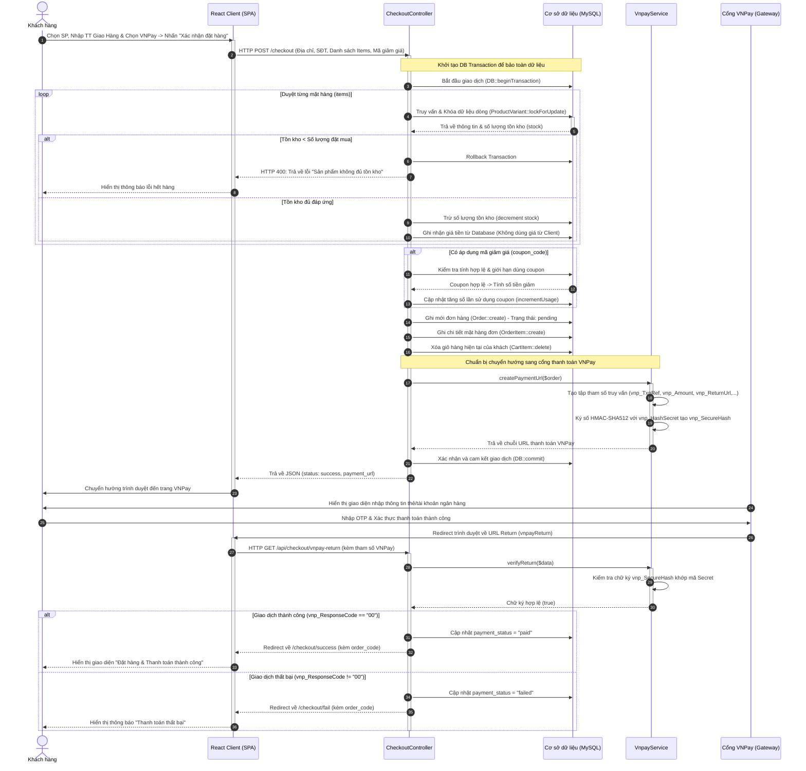
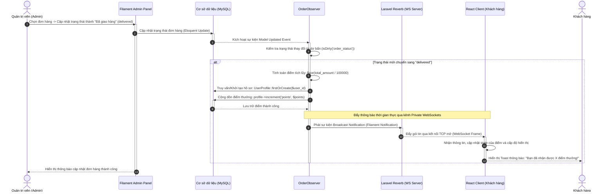
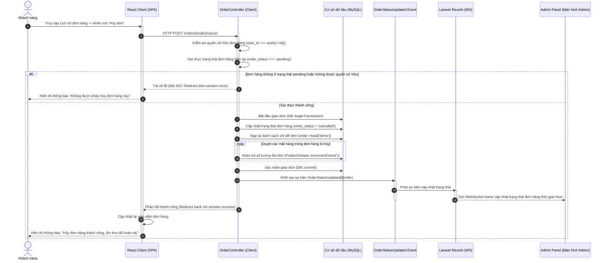
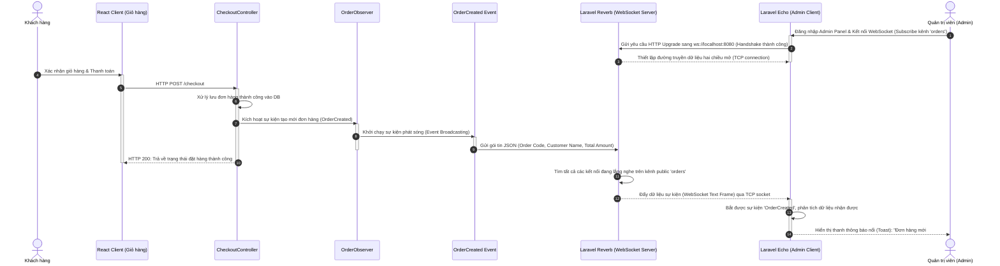

# BÁO CÁO KỸ THUẬT ĐỒ ÁN TỐT NGHIỆP: HỆ THỐNG TMĐT FLASHTECH
## PHÂN TÍCH THIẾT KẾ HỆ THỐNG & CÁC YÊU CẦU PHI CHỨC NĂNG

---

## 2.4 Sơ đồ tuần tự (Sequence Diagrams)

Phần này mô tả chi tiết các luồng tương tác thời gian thực giữa Tác nhân (Actor), Giao diện người dùng (React SPA Frontend), Bộ xử lý trung tâm (Laravel Backend Controllers & Services), Cơ sở dữ liệu (MySQL Database) và các dịch vụ tích hợp bên ngoài (Cổng thanh toán VNPay, WebSocket Server Laravel Reverb). Các sơ đồ được thiết kế chính xác theo cấu trúc mã nguồn thực tế của dự án **FlashTech**.

### 2.4.1 Quy trình Đặt hàng và Thanh toán qua cổng VNPay (Advanced Checkout & VNPay)

Sơ đồ này biểu diễn tiến trình khách hàng tiến hành thanh toán giỏ hàng, hệ thống khóa tồn kho tránh Race Condition, liên kết cổng thanh toán VNPay, xử lý phản hồi bất đồng bộ (Callback/Return) để xác nhận trạng thái đơn hàng.

#### Thuyết minh quy trình:
Quy trình đặt hàng và thanh toán trực tuyến được khởi đầu khi khách hàng chọn sản phẩm, hoàn tất điền thông tin giao hàng và chọn phương thức VNPay trên giao diện React SPA, sau đó nhấn nút "Xác nhận đặt hàng". Trình duyệt sẽ gửi một yêu cầu HTTP POST chứa toàn bộ thông tin đơn hàng tới API `/checkout` của hệ thống Backend Laravel. Tại đây, `CheckoutController` tiếp nhận yêu cầu và khởi tạo một Database Transaction nhằm đảm bảo tính toàn vẹn dữ liệu. Với từng sản phẩm trong giỏ hàng, hệ thống thực hiện truy vấn và kích hoạt khóa bi quan (Pessimistic Locking) bằng lệnh `lockForUpdate` để khóa tạm thời dòng dữ liệu của biến thể sản phẩm đó. Sau khi kiểm tra lượng tồn kho khả dụng, nếu số lượng trong kho nhỏ hơn số lượng đặt mua, hệ thống sẽ thực hiện khôi phục dữ liệu (Rollback) và trả về phản hồi lỗi. Ngược lại, nếu tồn kho đáp ứng đủ, hệ thống sẽ tiến hành trừ trực tiếp số lượng sản phẩm trong cơ sở dữ liệu và lưu lại giá sản phẩm tương ứng.

Sau đó, nếu đơn hàng có áp dụng mã giảm giá hợp lệ, hệ thống sẽ tính toán số tiền chiết khấu và tự động tăng số lần sử dụng của mã đó. Đơn hàng mới sẽ được lưu vào bảng `orders` với trạng thái ban đầu là "pending", đồng thời các bản ghi tương ứng cũng được tạo trong bảng chi tiết đơn hàng `order_items` và các sản phẩm cũ trong giỏ hàng của khách hàng sẽ bị xóa bỏ. Tiếp theo, hệ thống gọi `VnpayService` để tạo đường dẫn thanh toán. Dịch vụ này tổng hợp các tham số cần thiết, thực hiện ký số bằng thuật toán mã hóa HMAC-SHA512 với chuỗi bí mật của ứng dụng để tạo ra mã chữ ký an toàn `vnp_SecureHash`, tránh các rủi ro giả mạo thông số giao dịch. Khi URL thanh toán được trả về, Laravel Backend sẽ thực hiện commit transaction để lưu lại toàn bộ các thay đổi và gửi phản hồi thành công chứa liên kết này về cho Client React SPA. Lúc này, trình duyệt của khách hàng sẽ tự động chuyển hướng sang cổng thanh toán VNPay Sandbox.

Sau khi khách hàng tiến hành nhập thông tin tài khoản ngân hàng và thực hiện xác thực OTP thành công trên giao diện của VNPay, cổng thanh toán này sẽ chuyển hướng khách hàng quay trở lại URL Return của hệ thống. Client React SPA sẽ nhận sự kiện và gửi yêu cầu xác minh kết quả thanh toán lên endpoint `/api/checkout/vnpay-return` của Laravel. `CheckoutController` tiếp nhận dữ liệu trả về và chuyển tiếp cho `VnpayService` để thực hiện xác thực chữ ký bảo mật. Nếu kết quả xác định chữ ký là hợp lệ và mã phản hồi trả về từ VNPay có giá trị "00" (giao dịch thành công), hệ thống sẽ cập nhật trạng thái thanh toán của đơn hàng thành "paid" và chuyển hướng người dùng về trang thông báo đặt hàng thành công của React SPA. Ngược lại, nếu chữ ký không hợp lệ hoặc giao dịch bị lỗi từ phía ngân hàng, trạng thái thanh toán của đơn hàng được cập nhật thành "failed" và khách hàng sẽ được chuyển hướng về trang thông báo giao dịch thất bại để có thể thực hiện lại thao tác.

---

### 2.4.2 Quy trình Tích lũy Điểm thưởng & Tự động Cập nhật Hạng thành viên (Loyalty Points & Tiers)

Tiến trình tự động tích lũy điểm thưởng cho khách hàng khi Admin xác nhận đơn hàng thành công, đồng thời hệ thống tính toán hạng thành viên mới và đẩy thông báo thời gian thực về phía Client.

#### Thuyết minh quy trình:
Quy trình tích lũy điểm thưởng và cập nhật cấp độ thành viên được tự động kích hoạt khi quản trị viên thực hiện cập nhật trạng thái đơn hàng trên bảng điều khiển quản trị Filament Admin Panel. Khi quản trị viên chọn đơn hàng cần cập nhật, chuyển đổi trạng thái thành "delivered" (Đã giao hàng) và xác nhận lưu thông tin, Filament sẽ gửi yêu cầu cập nhật bản ghi trong cơ sở dữ liệu. Nhờ cơ chế sự kiện Eloquent, khi bản ghi đơn hàng thay đổi, lớp `OrderObserver` sẽ tự động bắt được sự kiện cập nhật và kiểm tra xem thuộc tính trạng thái đơn hàng có sự thay đổi từ trước đó hay không.

Nếu trạng thái đơn hàng vừa chuyển đổi sang giá trị hoàn thành, hệ thống sẽ tự động tính toán số điểm tích lũy được dựa trên giá trị tổng hóa đơn theo công thức làm tròn xuống với tỷ lệ một điểm ứng với mỗi một trăm nghìn đồng giá trị thanh toán. Kế tiếp, Observer sẽ gọi phương thức cập nhật điểm thưởng để truy vấn hoặc khởi tạo hồ sơ người dùng trong bảng `user_profiles` và cộng dồn điểm mới vào tổng điểm tích lũy hiện tại của người dùng. Để nâng cao trải nghiệm người dùng, hệ thống sử dụng máy chủ WebSocket Laravel Reverb phát sóng một sự kiện thông báo thời gian thực đến kênh riêng tư dành riêng cho khách hàng đó. Khi trình duyệt React SPA của khách hàng bắt được sự kiện phát sóng này thông qua kết nối WebSocket đã thiết lập sẵn, hệ thống sẽ thực hiện cập nhật lại trạng thái điểm hiển thị trên thanh điều hướng và hiển thị một thông báo nổi (toast) báo hiệu khách hàng đã nhận được điểm thưởng mà không cần tải lại trang.

---

### 2.4.3 Quy trình Hủy đơn hàng và Tự động Hoàn trả Tồn kho (Self-Cancel Logic)

Khi đơn hàng ở trạng thái chờ xử lý (pending), khách hàng có quyền chủ động hủy đơn. Hệ thống sẽ kích hoạt luồng trả lại tồn kho cho các sản phẩm trong đơn một cách an toàn thông qua cơ chế Transaction.

#### Thuyết minh quy trình:
Khi khách hàng truy cập vào trang lịch sử đơn hàng cá nhân trên giao diện React SPA và muốn hủy một đơn hàng đang ở trạng thái chờ xử lý, họ có thể nhấn vào nút "Hủy đơn". Trình duyệt khách hàng sẽ ngay lập tức gửi một yêu cầu HTTP POST đến endpoint `/orders/{order}/cancel` của hệ thống Backend. Tại đây, `OrderController` tiếp nhận yêu cầu và tiến hành xác thực xem đơn hàng có thực sự thuộc quyền sở hữu của người dùng đang đăng nhập hay không, đồng thời đảm bảo trạng thái đơn hàng đó bắt buộc phải là chờ xử lý. Nếu các điều kiện xác thực này không được thỏa mãn, hệ thống sẽ từ chối xử lý và gửi phản hồi lỗi về phía Client.

Trong trường hợp các yêu cầu kiểm tra được thông qua, hệ thống sẽ khởi tạo một Database Transaction để bắt đầu luồng xử lý hủy đơn hàng một cách an toàn. Trạng thái của đơn hàng trong cơ sở dữ liệu sẽ được cập nhật thành "cancelled" (Đã hủy) và trạng thái thanh toán được cập nhật tương ứng tùy thuộc vào hình thức thanh toán ban đầu. Kế tiếp, controller sẽ tải danh sách các mặt hàng chi tiết trong đơn hàng và duyệt qua từng sản phẩm để thực hiện hoàn trả lại chính xác số lượng đặt mua vào cột tồn kho trong bảng `product_variants`. Sau khi xác nhận commit transaction thành công, hệ thống phát đi sự kiện `OrderStatusUpdated` để thông báo trạng thái đơn hàng đã thay đổi. Sự kiện này sẽ được máy chủ WebSocket Laravel Reverb đẩy trực tiếp đến giao diện màn hình quản trị của nhân viên quản lý đơn hàng. Phản hồi thành công cuối cùng được gửi về cho Client React SPA để cập nhật lại trạng thái đơn hàng trên giao diện của khách hàng.

---

### 2.4.4 Quy trình Gửi thông báo đơn hàng mới thời gian thực cho Admin (Real-time Broadcast)

Mô tả cách thức hệ thống tự động đẩy thông báo báo hiệu có đơn đặt hàng mới đến tất cả các màn hình làm việc của Quản trị viên trong vòng dưới 100ms mà không yêu cầu tải lại trang (F5).

#### Thuyết minh quy trình:
Để hiện thực hóa khả năng gửi thông báo đơn hàng mới theo thời gian thực, khi quản trị viên đăng nhập vào hệ thống và truy cập bảng điều khiển Filament Admin Panel, thư viện Laravel Echo trên Client của Admin sẽ tự động gửi yêu cầu nâng cấp kết nối HTTP thành kết nối WebSocket tới máy chủ Laravel Reverb thông qua cổng kết nối đã cấu hình. Sau khi handshake thành công, một kết nối TCP mở được thiết lập và duy trì liên tục giữa trình duyệt của quản trị viên và máy chủ Reverb để chờ nhận gói tin phát sóng trên kênh public "orders".

Khi một khách hàng thực hiện đặt đơn hàng thành công qua giao diện bán hàng, `CheckoutController` xử lý lưu trữ thông tin đơn hàng vào cơ sở dữ liệu và kích hoạt model observer. Tại đây, lớp `OrderObserver` bắt sự kiện tạo mới và khởi chạy sự kiện phát sóng `OrderCreated`. Dữ liệu sự kiện bao gồm mã đơn hàng, tên khách hàng và tổng giá trị đơn hàng sẽ được serialized thành định dạng JSON và đẩy tới máy chủ Laravel Reverb. Ngay khi nhận được gói tin, máy chủ Reverb sẽ tìm kiếm tất cả các phiên kết nối đang subscribe kênh "orders" và đẩy trực tiếp frame dữ liệu chứa thông báo đơn hàng mới tới trình duyệt của quản trị viên qua socket kết nối. Laravel Echo trên trình duyệt của admin nhận dữ liệu và kích hoạt hàm callback để hiển thị thông báo nổi thông báo có đơn hàng mới ngay lập tức trên màn hình làm việc của admin mà không cần họ phải thực hiện thao tác tải lại trang thủ công.

---

## 2.5 Yêu cầu phi chức năng (Non-functional Requirements)

Yêu cầu phi chức năng đặt ra các chỉ số chất lượng, ràng buộc thiết kế, tính khả thi và tiêu chuẩn vận hành của hệ thống FlashTech để đảm bảo hệ thống thương mại điện tử hoạt động trơn tru, bảo mật và dễ mở rộng.

### 2.5.1 Hiệu năng (Performance)
Về khía cạnh hiệu năng của hệ thống, FlashTech cam kết thời gian phản hồi (Response Latency) tối ưu cho các tác vụ của người dùng. Các truy vấn tìm kiếm sản phẩm, áp dụng bộ lọc theo thương hiệu hoặc danh mục, và điều hướng trang phải được xử lý và hiển thị thông tin trong khoảng thời gian dưới 200 mili-giây ở điều kiện kết nối mạng tiêu chuẩn. Đối với các quy trình thanh toán trực tuyến qua cổng VNPay, thời gian từ lúc gửi yêu cầu đặt hàng đến khi nhận được URL chuyển hướng thanh toán từ máy chủ được giới hạn tối đa dưới 500 mili-giây.

Để đạt được mục tiêu này ở phía client, hệ thống so sánh sản phẩm (Compare System) sử dụng bộ nhớ cục bộ `localStorage` của trình duyệt để lưu trữ danh sách các biến thể đã chọn tạm thời, giảm thiểu tối đa số lượng API request lên máy chủ khi khách hàng thực hiện thay đổi danh sách so sánh. Đồng thời, tài nguyên mã nguồn tĩnh của Frontend được biên dịch và tối ưu hóa bằng công cụ Vite thông qua cơ chế Code Splitting và nén Gzip/Brotli, đảm bảo dung lượng tải trang đầu tiên luôn nhỏ hơn 250KB. Phía backend, hệ thống tối ưu hóa cơ sở dữ liệu bằng cách thiết lập các chỉ mục (Indexes) trên các trường dữ liệu có tần suất truy vấn cao và sử dụng kỹ thuật Eager Loading trong Eloquent ORM để ngăn ngừa hoàn toàn lỗi truy vấn dư thừa N+1.

### 2.5.2 Độ tin cậy & Tính an toàn bảo mật (Reliability & Security)
Độ tin cậy và tính an toàn của hệ thống thương mại điện tử FlashTech được củng cố thông qua việc triển khai các cơ chế kiểm soát dữ liệu và phân quyền chặt chẽ. Hệ thống ngăn ngừa hiện tượng bán vượt tồn kho (Race Condition) bằng cách áp dụng cơ chế khóa bi quan (Pessimistic Locking) với câu lệnh `lockForUpdate()` trên dòng dữ liệu của biến thể sản phẩm trong suốt tiến trình xử lý giao dịch cơ sở dữ liệu (Database Transaction). Cơ chế này đảm bảo rằng khi có nhiều khách hàng cùng thực hiện thao tác thanh toán cho cùng một sản phẩm có số lượng tồn kho giới hạn, hệ thống sẽ tuần tự hóa các yêu cầu và ngăn chặn tình trạng số lượng tồn kho bị âm.

Bên cạnh đó, việc tích hợp thanh toán với cổng VNPay được bảo mật bằng cách xác thực chữ ký HMAC-SHA512 kèm mã bí mật ứng dụng cho mọi gói tin phản hồi từ cổng thanh toán, giúp loại trừ hoàn toàn nguy cơ giả mạo tham số giao dịch. Hệ thống cũng triển khai cơ chế kiểm soát quyền truy cập chi tiết thông qua các Middleware xác thực, phân chia rõ ràng quyền hạn của các nhóm tài khoản bao gồm khách hàng, nhân viên kiểm duyệt, nhân viên bán hàng và quản trị viên hệ thống để bảo vệ các tài nguyên API nhạy cảm khỏi các truy cập trái phép.

### 2.5.3 Tính dễ dùng (Usability - Premium UX/UI)
FlashTech chú trọng xây dựng một giao diện người dùng cao cấp (Premium UX/UI) lấy cảm hứng từ ngôn ngữ thiết kế tối giản của Apple. Bố cục trang được tích hợp hiệu ứng kính mờ (Glassmorphism) kết hợp với thanh điều hướng nổi tự động thay đổi kích thước khi cuộn trang để tối ưu không gian hiển thị sản phẩm. Giao diện của hệ thống hỗ trợ chuyển đổi mượt mà giữa chế độ Sáng và Tối (Dark/Light Mode), đảm bảo độ tương phản màu sắc hài hòa và bảo vệ thị lực người dùng trong các môi trường ánh sáng khác nhau.

Ngoài ra, tính năng thiết kế đáp ứng (Responsive Design) đảm bảo hệ thống hiển thị chính xác và đồng nhất trên mọi kích thước màn hình thiết bị từ điện thoại di động, máy tính bảng đến máy tính để bàn có độ phân giải lớn. Trải nghiệm tương tác của khách hàng còn được nâng cao nhờ các hiệu ứng nảy nút nhẹ nhàng, các thông báo toast trực quan của Sonner và khả năng chuyển đổi biến thể cấu hình laptop mượt mà thông qua thư viện Framer Motion mà không làm gián đoạn trải nghiệm người dùng do việc tải lại trang.

### 2.5.4 Tính dễ bảo trì & Phát triển (Maintainability)
Kiến trúc của FlashTech được thiết kế tuân thủ các nguyên lý lập trình hướng đối tượng và phân tách các thành phần chức năng rõ rệt nhằm nâng cao khả năng bảo trì và mở rộng trong tương lai. Ở phía backend, mã nguồn được xây dựng theo mô hình MVC tiêu chuẩn của Laravel kết hợp với mô hình kiến trúc hướng sự kiện (Event-driven Architecture) sử dụng Observers và Events. Điều này cho phép tách biệt hoàn toàn các tác vụ xử lý nghiệp vụ phụ trợ như tích lũy điểm, gửi thông báo hay hoàn trả tồn kho ra khỏi logic xử lý đặt hàng chính của controller, tạo điều kiện thuận lợi cho việc phát triển và bảo trì mã nguồn.

Ở phía frontend, các component của React được cấu trúc dưới dạng các thành phần độc lập, có tính tái sử dụng cao như `ProductCard` hay `OrderStatusStepper`, kết hợp với ngôn ngữ TypeScript nhằm thiết lập kiểm soát kiểu dữ liệu nghiêm ngặt ngay tại thời điểm lập trình. Hơn nữa, toàn bộ môi trường chạy ứng dụng được đóng gói đồng bộ bằng Docker và Laravel Sail, giúp đơn giản hóa quy trình cài đặt và đảm bảo tính nhất quán của môi trường phát triển từ máy lập trình cá nhân cho đến môi trường kiểm thử và triển khai thực tế.

### 2.5.5 Kiến trúc công nghệ (Technical Stack)
Hệ thống FlashTech được xây dựng trên một nền tảng công nghệ hiện đại và đồng bộ. Cơ sở dữ liệu quan hệ MySQL 8.0 được chuẩn hóa theo chuẩn 3NF để tối giản hóa sự trùng lặp thông tin và được ràng buộc chặt chẽ bằng hệ thống khóa ngoại để bảo toàn tính toàn vẹn dữ liệu. Backend của hệ thống vận hành trên nền PHP 8.3 kết hợp với framework Laravel 13, trong khi Frontend sử dụng thư viện React 19 kết hợp với Inertia.js để xây dựng ứng dụng trang đơn (SPA) tối ưu hóa trải nghiệm mà vẫn đảm bảo tốc độ định tuyến nhanh chóng. Đặc biệt, hạ tầng kết nối thời gian thực được hỗ trợ bởi máy chủ Laravel Reverb WebSocket Server chạy cục bộ trên cổng 8080 giúp truyền tải nhanh chóng các thông báo đến trình duyệt người dùng với độ trễ cực thấp.
